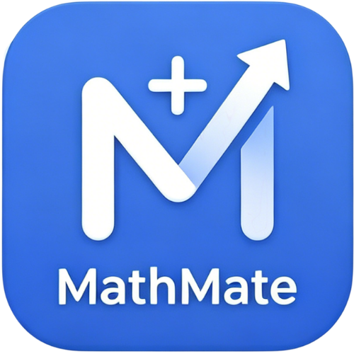

<div align="center">

  <!-- 数理锚点 Logo with Gradient -->
  

  # 🧮 数理锚点

  ### **AI 驱动的智能数学学习应用**

  [](https://flutter.dev)
  [](https://dart.dev)
  [](LICENSE)
  [](https://github.com/503496348-ops/mathanchor)
  [](https://github.com/503496348-ops/mathanchor/releases)

  **拍照搜题 · 几何可视化 · AI 对话助手 · 数学工具箱**

> 本项目的品牌名、服务端点、模型参数等均支持通过 `.env` 与 `lib/config/app_skin_config.dart` 进行可配置换皮。

  [演示视频](https://www.bilibili.com/video/BV1EfLJ6bEnw/)

</div>

---

## ✨ 核心功能

### 📸 拍照搜题 + AI 求解

支持手写和印刷题目的智能识别，AI 自动生成详细的分步解析。10 秒内完成「拍照 → 识别 → 解题 → 可视化」全流程，无题库限制。


### 🎨 交互式几何可视化

核心创新技术：AI 自动从题目文本中抽取几何参数，自研 `GeometryPainter` 引擎（纯 Dart Canvas）实时渲染可交互图形。支持拖拽动点、轨迹动画，60fps 原生帧率。

### 💬 AI 对话助手

嵌入式数学导师，提供一对一智能辅导。支持流式聊天、Markdown + LaTeX 实时渲染、深度思考链展示、多轮上下文对话。

### 🧰 GeoGebra 数学工具箱

集成 GeoGebra 离线版，提供：
- 🔬 科学计算器
- 📐 几何画板
- 📈 函数绘图
- 🎲 3D 视图
- 📏 尺规作图
- 🎲 概率模型

### 📝 智能笔记系统

- **手写笔记**：Catmull-Rom 样条平滑笔迹、AI 手写识别转 LaTeX
- **富文本笔记**：基于 flutter_quill，支持公式插入与图片嵌入
- **PDF 导入标注**：支持 PDF 查看与标注

### 🎬 个性化视频推荐

基于 DeepSeek AI 推荐算法 + 本地关键词匹配的 B 站数学视频推荐系统。

---

## 🎬 产品演示

<table align="center">
<tr>
<td align="center" width="600">

<a href="https://www.bilibili.com/video/BV1EfLJ6bEnw/">
  <div style="background: linear-gradient(135deg, #667eea 0%, #764ba2 100%); border-radius: 16px; padding: 40px 30px; text-align: center; color: white;">
    <div style="font-size: 60px; margin-bottom: 16px;">▶️</div>
    <div style="font-size: 22px; font-weight: bold; margin-bottom: 8px;">数理锚点 产品演示视频</div>
    <div style="font-size: 14px; opacity: 0.9;">AI 拍照搜题 · 几何可视化 · 智能对话 · 数学工具箱</div>
    <div style="margin-top: 16px; display: inline-block; background: rgba(255,255,255,0.2); padding: 8px 20px; border-radius: 20px; font-size: 13px;">
      🕐 时长 3 分钟 · 点击播放
    </div>
  </div>
</a>

</td>
</tr>
</table>

---

## 🏗️ 技术架构

```
┌─────────────────────────────────────────────────────────────┐
│                     数理锚点 应用层                          │
│  拍照搜题 │ AI 对话助手 │ 数学工具箱 │ 手写笔记 │ 视频推荐  │
└─────────────────────────────────────────────────────────────┘
                              ↓
┌─────────────────────────────────────────────────────────────┐
│                      服务层 (Service Layer)                  │
│  MathPipelineService │ ChatStreamService │ GeometryPainter  │
└─────────────────────────────────────────────────────────────┘
                              ↓
┌─────────────────────────────────────────────────────────────┐
│                   AI 模型层 (Multi-Model AI)                  │
│     DeepSeek │ Volc Engine OCR │ Qwen-PLUS                 │
└─────────────────────────────────────────────────────────────┘
                              ↓
┌─────────────────────────────────────────────────────────────┐
│                  可视化引擎 (自研 Flutter 原生)               │
│        GeometryPainter (纯 Dart Canvas · 60fps)             │
└─────────────────────────────────────────────────────────────┘
```

### 技术栈

| 分类 | 技术 |
|:-----|:-----|
| **前端框架** | Flutter 3.x (Dart ^3.11.3) |
| **AI 模型** | DeepSeek API / 火山引擎多模态 / Qwen-PLUS |
| **数据库** | Hive (本地 NoSQL) |
| **可视化** | 自研 GeometryPainter + GeoGebra WebView |
| **公式渲染** | KaTeX / flutter_math_fork |
| **富文本** | flutter_quill |

---

## 🚀 快速开始

### 环境要求

- Flutter SDK >= 3.11.3
- Dart SDK >= 3.11.3
- Android Studio / Xcode
- Node.js >= 16.0.0 (用于 Web 代理服务器)

### 安装

```bash
# 1. 克隆项目
git clone https://github.com/503496348-ops/mathanchor.git
cd mathanchor

# 2. 安装依赖
flutter pub get

# 3. 复制环境变量模板
cp .env.example .env

# 4. 编辑 .env 文件，填入你的 API Key
nano .env
```

**`.env` 配置示例：**

```bash
# 应用元信息
APP_NAME=数理锚点
APP_VERSION=2.3.2
APP_BUILD_NUMBER=2302

# 应用后端
AUTH_API_BASE_URL=https://your-domain.com/api/auth
LIBRARY_API_BASE_URL=https://your-domain.com/api/library
GEOGEBRA_CHAT_URL=https://example.com/api/geogebra/chat

# DeepSeek API
DEEPSEEK_API_KEY=sk-your-deepseek-api-key
DEEPSEEK_API_URL=https://api.deepseek.com
DEEPSEEK_MODEL_ID=deepseek-chat
DEEPSEEK_BASE_URL=https://api.deepseek.com/chat/completions

# 火山引擎 API
VOLC_API_KEY=your-volc-api-key
VOLC_MODEL_ID=ep-xxxxxxxxxxxxxxxxxxxx
VOLC_BASE_URL=https://ark.cn-beijing.volces.com/api/v3/chat/completions

# 阿里云 Qwen（用于 VivoAiChatService）
VIVO_API_KEY=your-vivo-api-key
VIVO_MODEL_ID=qwen-plus
VIVO_BASE_URL=https://dashscope.aliyuncs.com/compatible-mode/v1/chat/completions

# 可选：更新检测（返回 version.json）
APP_UPDATE_VERSION_URL=
APP_FEATURE_AUTO_UPDATE_CHECK=false
```

### 皮肤化改造注意点

本仓库新增 `lib/config/app_skin_config.dart`，所有可定制品牌与域名配置都通过 env 读取。换皮时请优先
- 修改 `.env` 里的 `APP_NAME / APP_VERSION / ...` 系列变量
- 不要硬编码产品名到业务代码里
- 不要把旧域名保留在代码逻辑分支中

- DeepSeek 兼容两套变量：`DEEPSEEK_API_URL`（推荐）与 `DEEPSEEK_BASE_URL`（兼容）


### 运行

```bash
# Android / iOS
flutter run

# Web
flutter build web --release
```

---

## 📦 项目结构

```
lib/
├── main.dart                      # 应用入口
├── models/                        # 数据模型
├── services/                      # 服务层
│   ├── math_pipeline_service.dart # 核心流水线
│   ├── ocr_service.dart           # OCR 识别
│   ├── solver_service.dart        # AI 解题
│   ├── visualization_service.dart # 几何可视化
│   └── prompts/                   # AI 提示词模板
├── visualization/                 # 几何可视化引擎
│   ├── geometry_painter.dart      # Canvas 渲染引擎
│   └── geometry_validator.dart    # JSON 校验
├── scanner/                       # 拍照与裁剪
├── pages/                         # 功能页面
└── theme/                         # 主题配置
```

---

## 🎯 核心优势

| 维度 | 数理锚点 | 传统搜题 App | 通用大模型 |
|:-----|:--------:|:------------:|:----------:|
| **解题方式** | AI 实时推理 | 题库匹配 | 文本推理 |
| **几何可视化** | ✅ 交互式图形 | ❌ 静态图片 | ❌ 无 |
| **题目覆盖** | 无题库限制 | 仅题库收录 | 中等 |
| **个性化辅导** | ✅ 多轮对话 | ❌ 无 | ✅ 对话 |
| **专业工具** | ✅ GeoGebra 6件套 | ❌ 无 | ❌ 无 |
| **数学严谨性** | ★★★★★ 92分 | ★★☆☆☆ 48分 | ★★★☆☆ 72分 |


---

## 🔮 开发路线

### ✅ 已完成 (v1.0.0)

- [x] 核心流水线（OCR → 解题 → 可视化）
- [x] AI 对话助手（流式响应）
- [x] GeoGebra 工具箱集成
- [x] 手写笔记 + 富文本笔记
- [x] PDF 查看与标注
- [x] B 站视频推荐系统
- [x] Web 平台支持
- [x] 数据库迁移（Isar → Hive）

### 🚧 进行中

- [ ] 个人知识图谱构建
- [ ] 智能错题本
- [ ] LaTeX 公式编辑器组件

### 📋 计划中

- [ ] 本地化 AI（flutter_onnxruntime）
- [ ] 3D 几何可视化增强
- [ ] Wolfram Alpha / Symbolab 集成
- [ ] 学习路径智能推荐

---

## 📄 开源协议

本项目采用 **MIT 协议**开源 — 详见 [LICENSE](LICENSE) 文件

---

## 🌟 Star History

<p align="center">
  <a href="https://github.com/503496348-ops/mathanchor/stargazers">
    
  </a>
</p>

感谢所有给本项目点 Star 的朋友们！ ⭐

---

<div align="center">

  **如果觉得有用，请给我们一个 ⭐Star⭐**

  Made with ❤️ by 数理锚点

  [问题反馈](https://github.com/503496348-ops/mathanchor/issues)

</div>
